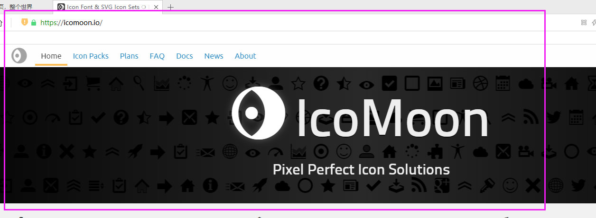
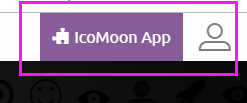
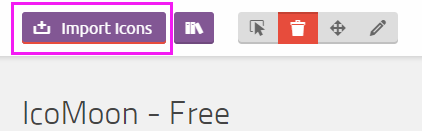
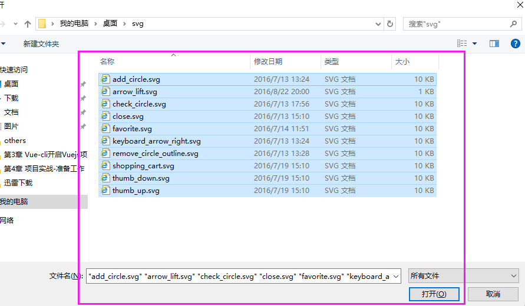
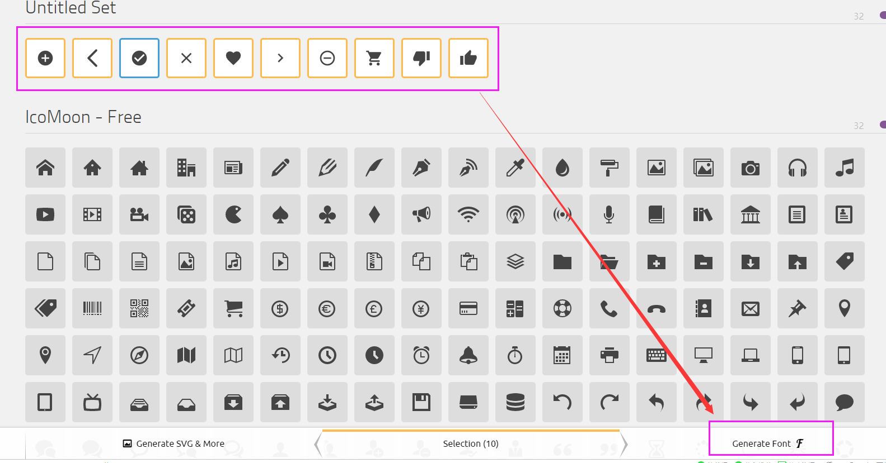
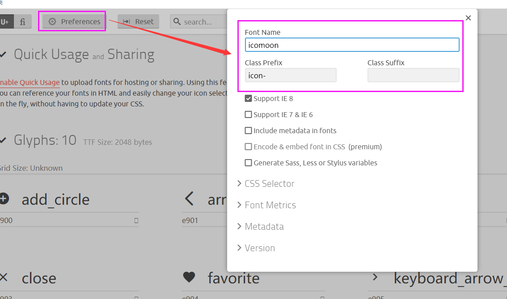
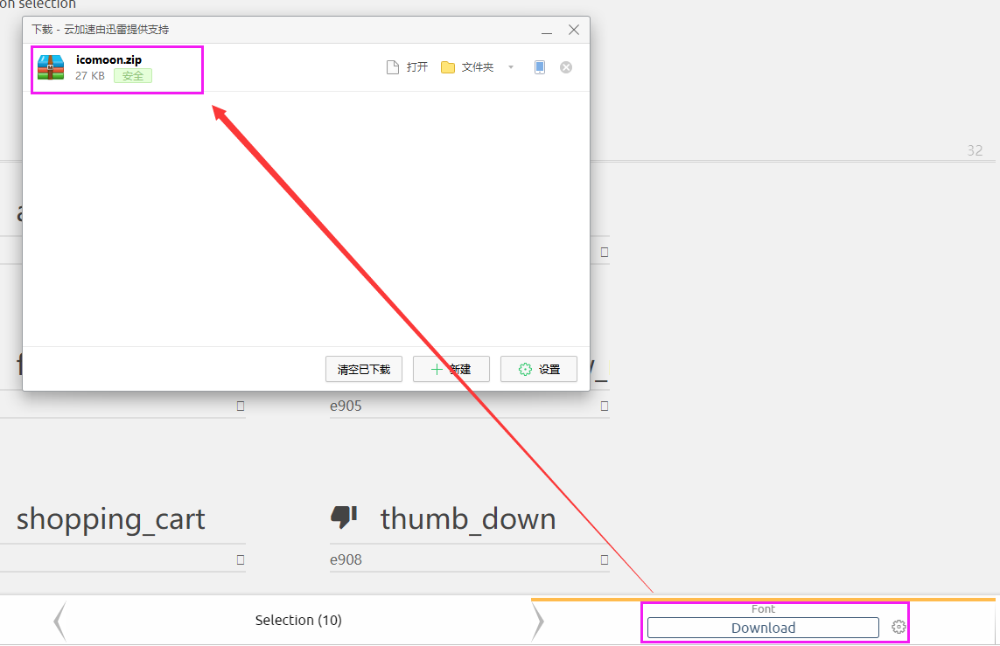
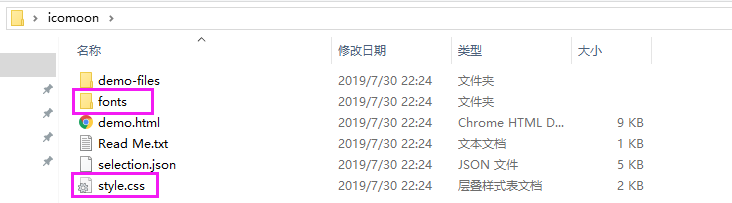

# 字体图标制作及引用方式  (网站：https://icomoon.io)

## 1.打开icomoon网站

## 2.点击右上角“IcoMoon App”按钮

## 3.点击左上角“Import Icons”按钮

## 4.选择要上传的SVG文件，上传到网站

## 5.上传完成后,全选所有要转化的图标，点击右下角“Generate Font”按钮

## 6.通过“Preferences”按钮可以设置字体名称，前缀的信息

## 7.点击右下“Download”按钮，点击下载压缩包

## 8.打开压缩包，把fonts文件夹和style.css文件引入到项目中，通过html的span标签使用字体图标

~ 完 ~

