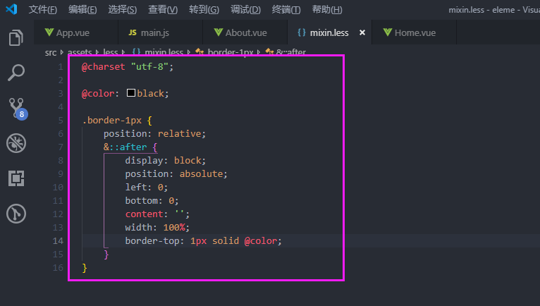
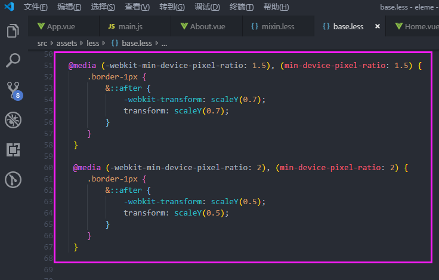
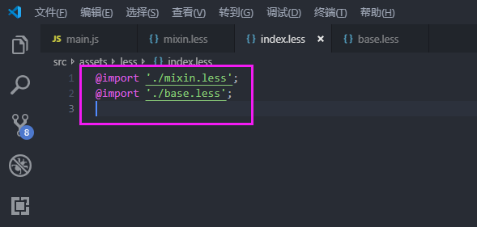
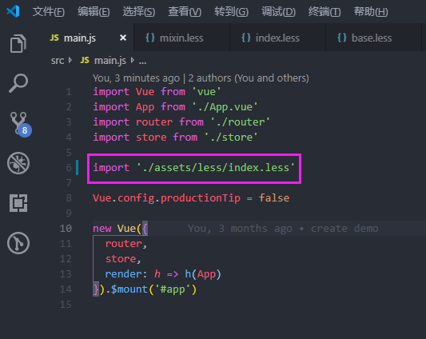
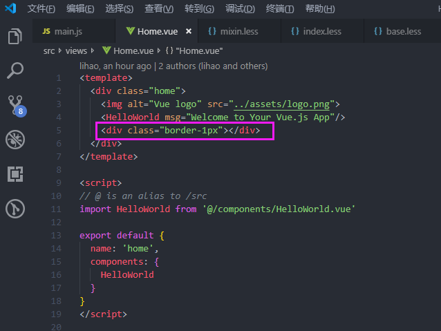

# web app如何实现1像素边框

## 1.在mixin.less文件里面定义如下代码

@color: #ccc;

.border-1px {
	position: relative;
	&::after {
		display:block;
		position: absolute;
		left: 0;
		bottom: 0;
		content: '';
		width: 100%;
		border-top: 1px solid @color;
	}
}

## 2.在base.less文件里面根据设备像素比来设置边框高度，代码如下

@media (-webkit-min-device-pixel-ratio: 1.5), (min-device-pixel-ratio: 1.5) {
	.border-1px {
		&::after {
			-webkit-transform: scaleY(0.7);
			transform: scaleY(0.7);
		}
	}	
}

@media (-webkit-min-device-pixel-ratio: 2.0), (min-device-pixel-ratio: 2.0) {
	.border-1px {
		&::after {
			-webkit-transform: scaleY(0.5);
			transform: scaleY(0.5);
		}
	}
}

## 3.在index.less文件里面引入mxin.less文件和base.less文件，然后在main.js文件内引入index.less文件

@import './mixin.less';
@import './base.less';

import './assets/less/index.less';

## 4.在需要的元素上添加"border-1px"类即可，通过“开发web app如何用手机查看效果”可以查看效果

