# 如何搭建一个vue工程化开发的项目

## 一、创建

### 通过Vue cli工具来创建一个vue-template项目，参考如下

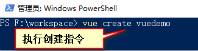

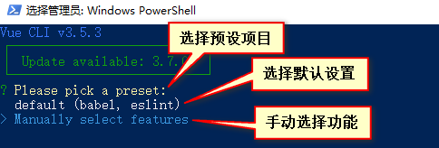

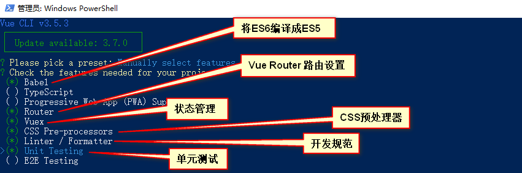

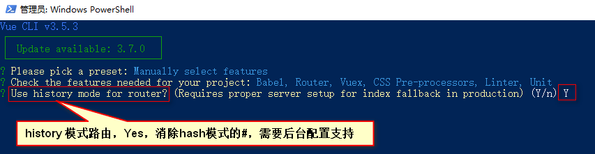

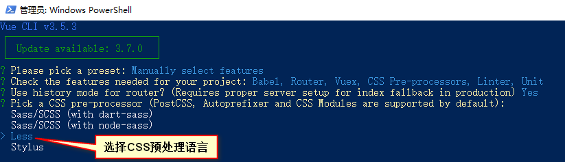

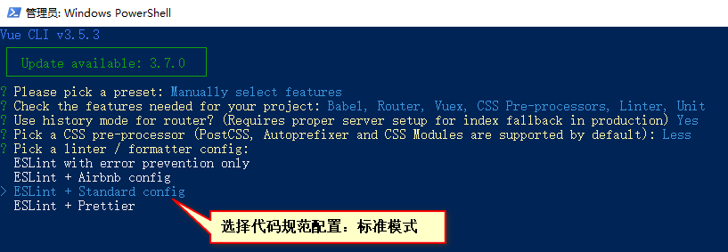

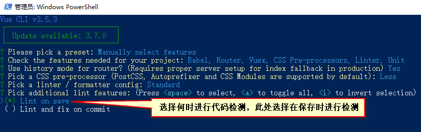

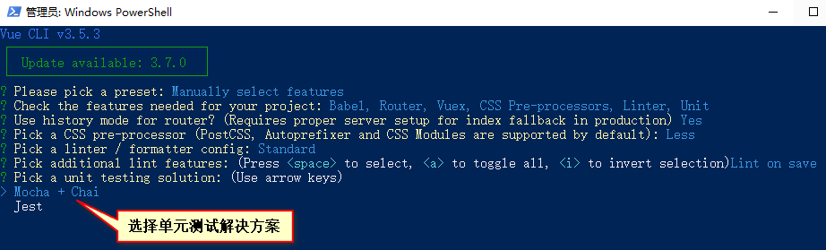

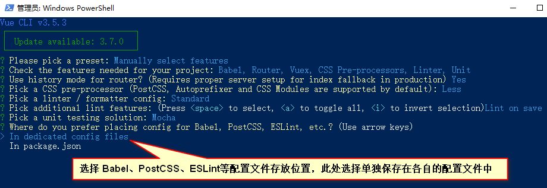

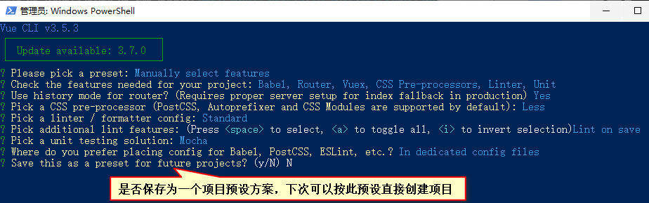

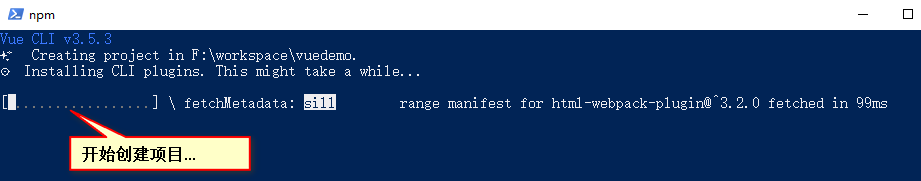

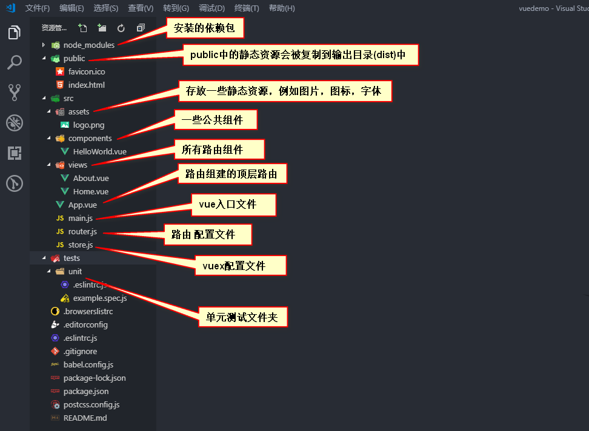

## 二、配置

### 1.配置vue.config.js文件

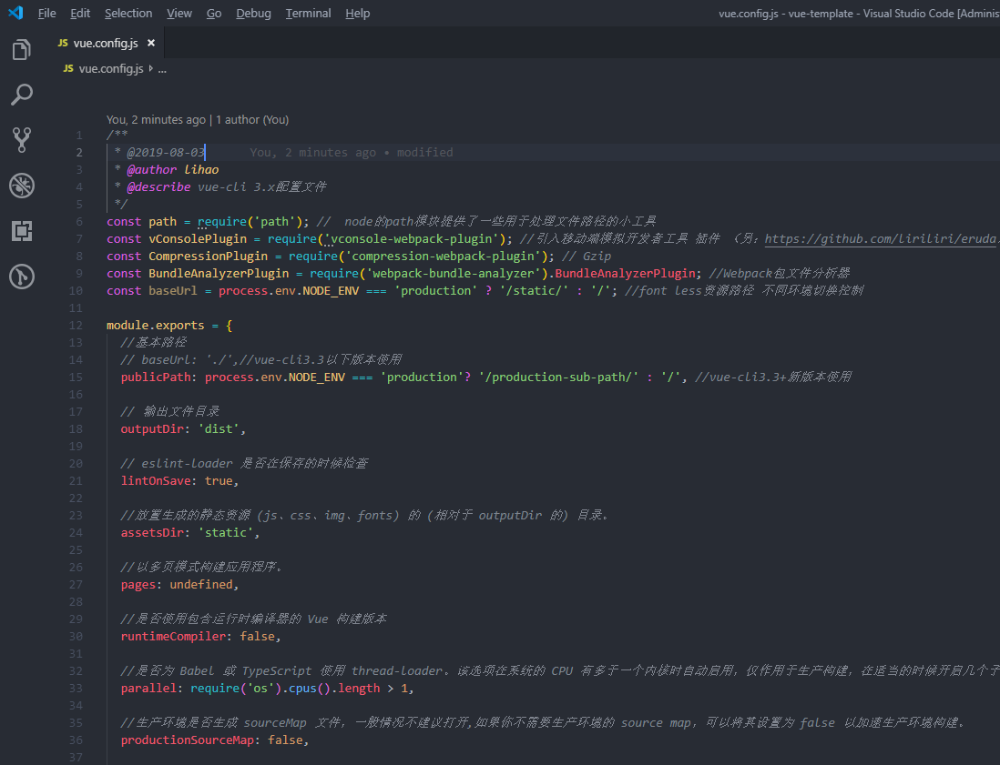

### 2.配置样式相关（reset.less,mixin.less,index.less,postcss.js等等）

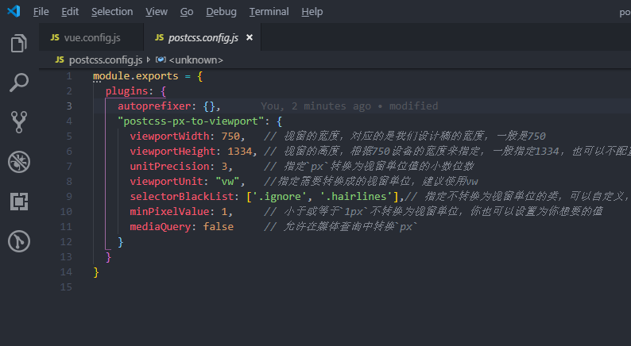

### 3.配置router.js和vuex

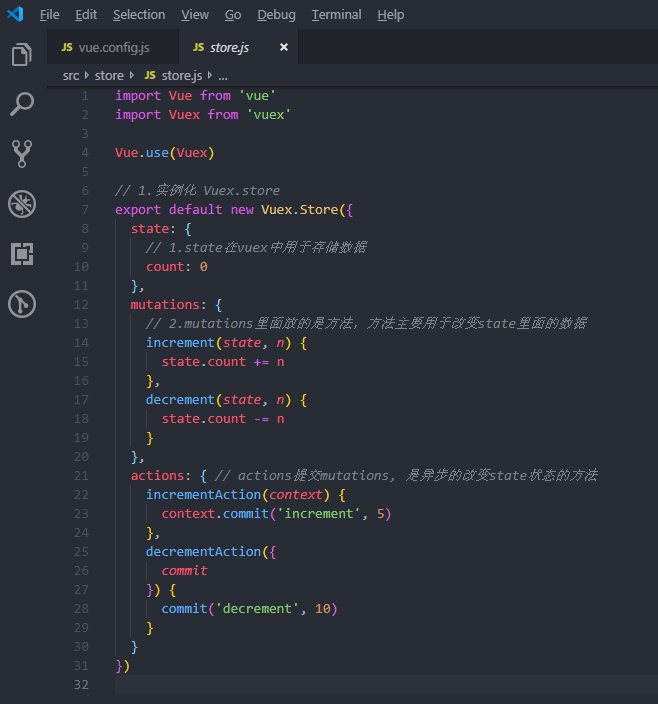

### 4.配置后台数据请求对象

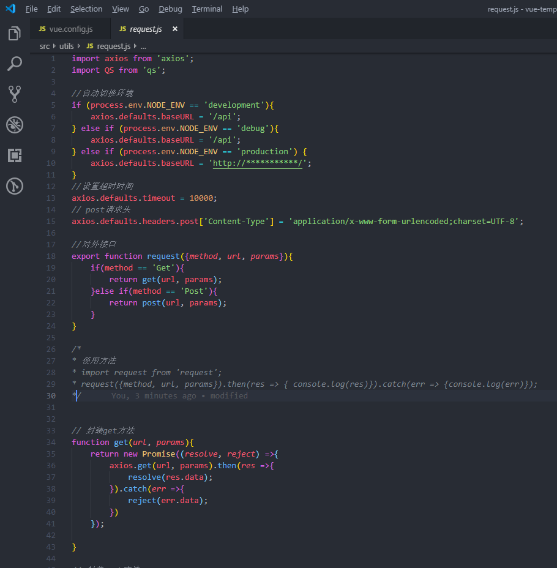

### 5.配置

